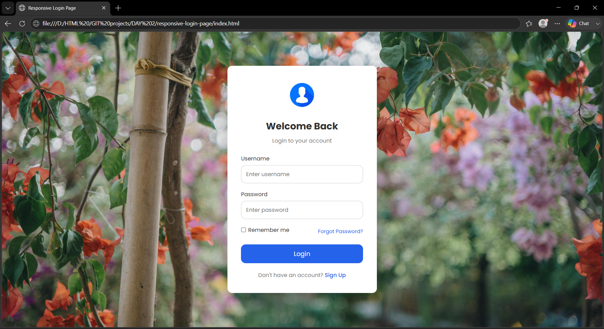

# Responsive Login Page

A clean, modern, and fully responsive login page built using **HTML5** and **CSS3**. This project focuses on creating a simple, user-friendly authentication interface with a responsive layout that works across desktop, tablet, and mobile devices.

---

## 📸 Preview



> Replace `login-preview.png` with a screenshot of your project if available.

---

## 🚀 Features

- Responsive design
- Modern and clean user interface
- Username and password input fields
- Remember Me checkbox
- Forgot Password link
- Sign Up link
- Mobile-friendly layout
- Google Fonts (Poppins)
- Hover effects
- Well-structured HTML & CSS

---

## 🛠️ Technologies Used

- HTML5
- CSS3
- Google Fonts (Poppins)

---

## 📂 Project Structure

```
responsive-login-page/
│
├── index.html
├── style.css
├── README.md
└── images/
    ├── user.png
    └── Background for login page.jpg
```

---

## 🎯 Learning Objectives

This project helped me practice:

- Semantic HTML
- CSS Layout
- Responsive Design
- Flexbox
- Form Styling
- Typography
- CSS Hover Effects
- Project Folder Organization

---

## 💻 Live Demo

Coming Soon...

---

## 👨‍💻 Author

**Vignesh**

UI/UX Designer • Front-End Developer

GitHub:
https://github.com/codingwithvignesh

---

## ⭐ If you like this project

Give this repository a ⭐ on GitHub.

---

### Day 2 of My HTML & CSS Challenge 🚀

Building one front-end project every day to improve my UI development skills and maintain my GitHub contribution streak.